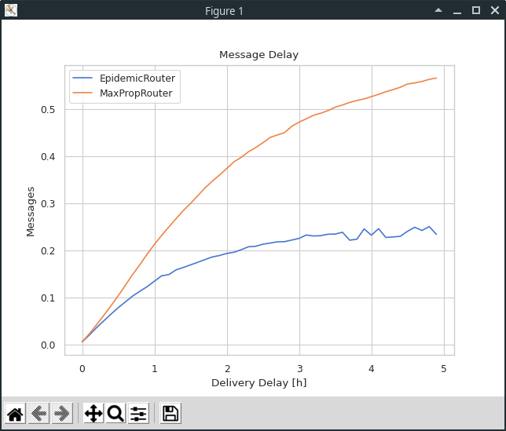

# OneTwo Reporting Toolkit

The OneTwo Reporting Toolkit is a CLI-driven program for the easy and intuitive analysis and visualization of 
simulation reports from The OneTwo. This README has two parts: A User Guide immediately after this introduction
and a [Developer Guide](#developer-guide) below.

# User Guide

(for the developer guide, [see further down](#developer-guide))

## Getting started

The OneTwo Reporting Toolkit supports Python 3.6.2 and above. For managing the virtual environment and all needed
dependencies, we use Poetry. Install it as described [here](https://python-poetry.org/docs/#installation).

Clone the repository and then spin up the virtual env (obviously omit the `--no-dev` if you plan on developing):

```shell
$ git clone git@github.com:stg-tud/the-onetwo.git
$ cd the-onetwo/reporting
$ poetry shell
$ poetry install --no-dev
```


### Installation using `pip` / Problems During Installation

A `requirements.txt` is included, if you prefer to install dependencies with `pip`.

We bumped into configurations that lead to errors during the installation of `numpy` (Pandas dependency). In these cases,
try easing the compatibility constraints imposed by the interpreter by setting the Python version to at least `^3.8`
in order to allow more recent packages.

## Overview

OneTwo Reporting has three top level commands that can be executed on one or more generated report text-files:

- `diff`:    Compare two generated simulation report files
- `graph`:   Draw graphs based on the generated report files (has sub-commands different report classes)
- `stats`:   Get stats from the generated report files

Two commands are for other operations:

- `config`:  Configures default values from config.ini
- `i`:       Start an interactive run of the toolkit, during which you will be guided on setting options


## Usage

A command is followed by a set of options that define its behaviour. If no options are given, sane defaults are used but
there is no recovering from errors (e.g. if files are not found). There is also the option to take the interactive
user-prompt way to decide options for the top level commands.

See the `config.ini` for the defaults used by some options.

Let's first take a look at an example before we dive into the available commands in-depth:

### Example

The toolkit uses **Report Groups** to define a collection of reports that somehow belong together. E.g. when a
simulation uses multiple random seeds with the same overall settings, the resulting reports can be grouped into a
**Report Group**.

Example: We have

- 5 simulation runs with different random seed in which a group of hosts is equipped with EpidemicRouters.
  MessageDelayReports from these runs are called
  - MessageDelayReport_rng-1_EpidemicRouter.txt
  - MessageDelayReport_rng-2_EpidemicRouter.txt
  - ...
  - MessageDelayReport_rng-5_EpidemicRouter.txt
- 10 simulation runs with different random seed in which a group of hosts is equipped with MaxPropRouters:
  - MessageDelayReport_rng-1_MaxPropRouters.txt
  - MessageDelayReport_rng-2_MaxPropRouters.txt
  - ...
  - MessageDelayReport_rng-10_MaxPropRouters.txt

We can now show graphs of the message delays using the command

```shell
$ ./toolkit.py graph delay --group "MessageDelay*Epidemic*" "EpidemicRouter" \
                           --group "MessageDelay*MaxProp*" "MaxPropRouter"
```

As you can see, the report groups are defined by an option tuple of a glob pattern and a group name. The glob pattern 
will select the desired files in the reports directory and the group name will determine the 
labeling of the result in the graph output:



There are a lot of defaults in play here, i.e. the location of the reports directory, graph theme, quantisation
interval, and a few others. Provided further options like `--file-format` and `--output-directory`, this output 
could also be saved to PDF or other file formats.


## Command Hierarchy

The main program has no function other than to show version info or help. Other than that, it mainly delegates the work
to the five top level commands.

```shell
$ ./toolkit.py --help
Usage: toolkit.py [OPTIONS] COMMAND [ARGS]...

Options:
  -v, --version  Show version and exit.
  --help         Show this message and exit.

Commands:
  config  Configures default values from config.ini.
  diff    Compare two generated simulation report files.
  graph   Draw graphs based on the generated report files.
  i       Interactive way to use the reporting tool.
  stats   Get stats from the generated report files.

```

### Graph

`graph` will build graphs from reporting data files using the
[Seaborn library](https://seaborn.pydata.org/). Depending on the provided sub-commands `delay`, `delivery`, or `stats`,
different sorts of reports can be visualized. See the report-specific sections for the run-down of possible options.

```shell
$ ./toolkit.py graph --help
Usage: toolkit.py graph [OPTIONS] COMMAND [ARGS]...

  Draw graphs based on the generated report files.

Options:
  --help  Show this message and exit.

Commands:
  delay     Draw graphs based on MessageDelayReport files.
  delivery  Draw graphs based on MessageDeliveryReport files.
  stats     Draw graphs based on MessageStatsReport files.

```

#### graph delay

The `graph` sub-command to visualize reports generated with the MessageDelayReport class.

```shell
$ ./toolkit.py graph delay --help
Usage: toolkit.py graph delay [OPTIONS]

  Draw graphs based on MessageDelayReport files.

Options:
  -c, --context [paper|notebook|talk|poster]
                                  Seaborn context for the generated graphs
                                  [default: paper]
  -e, --estimator [mean|median]   Estimator to graph when comparing multiple
                                  groups  [default: median]
  --filename-prefix TEXT          Prefix to prepend to all output files
  -g, --group <TEXT TEXT>...      Report groups. Each group is a tuple of a
                                  glob pattern and a name for this group of
                                  reports. If more than one group is
                                  specified, reports matched by different
                                  patterns will be aggregated
  -n, --no-show                   Do not show output
  -o, --output-dir PATH           Output directory  [default: ./output/]
  -f, --output-format [eps|jpeg|jpg|pdf|pgf|png|ps|raw|rgba|svg|svgz|tif|tiff]
                                  Image format for outputs. Output will only
                                  be saved if this option is not left empty
  -p, --palette [deep|muted|bright|pastel|dark|colorblind]
                                  Seaborn color palette for the generated
                                  graphs  [default: muted]
  -d, --reports-dir PATH          Report directory  [default: ../reports/]
  -y, --style [white|dark|whitegrid|darkgrid|ticks]
                                  Seaborn style for the generated graphs
                                  [default: whitegrid]
  -q, --quant INTEGER             Quantisation period in seconds for
                                  MessageDelayReports and
                                  MessageDeliveryReports  [default: 360]
  --help                          Show this message and exit.
```

#### graph delivery

The `graph` sub-command to visualize reports generated with the MessageDelayReport class. Two graphs are generated:
one each for the absolute and the relative number of delivered messages.

```shell
$ ./toolkit.py graph delivery --help
Usage: toolkit.py graph delivery [OPTIONS]

  Draw graphs based on MessageDeliveryReport files.

Options:
  -c, --context [paper|notebook|talk|poster]
                                  Seaborn context for the generated graphs
                                  [default: paper]
  -e, --estimator [mean|median]   Estimator to graph when comparing multiple
                                  groups  [default: median]
  --filename-prefix TEXT          Prefix to prepend to all output files
  -g, --group <TEXT TEXT>...      Report groups. Each group is a tuple of a
                                  glob pattern and a name for this group of
                                  reports. If more than one group is
                                  specified, reports matched by different
                                  patterns will be aggregated
  -n, --no-show                   Do not show output
  -o, --output-dir PATH           Output directory  [default: ./output/]
  -f, --output-format [eps|jpeg|jpg|pdf|pgf|png|ps|raw|rgba|svg|svgz|tif|tiff]
                                  Image format for outputs. Output will only
                                  be saved if this option is not left empty
  -p, --palette [deep|muted|bright|pastel|dark|colorblind]
                                  Seaborn color palette for the generated
                                  graphs  [default: muted]
  -d, --reports-dir PATH          Report directory  [default: ../reports/]
  -y, --style [white|dark|whitegrid|darkgrid|ticks]
                                  Seaborn style for the generated graphs
                                  [default: whitegrid]
  -q, --quant INTEGER             Quantisation period in seconds for
                                  MessageDelayReports and
                                  MessageDeliveryReports  [default: 360]
  --help                          Show this message and exit.
```

#### graph stats

The `graph` sub-command to visualize reports generated with the MessageDelayReport class. For each chosen `--stat`,
one graph will be generated comparing that statistic's value between all report groups. 

```shell
$ ./toolkit.py graph stats --help
Usage: toolkit.py graph stats [OPTIONS]

  Draw graphs based on MessageStatsReport files.

Options:
  -c, --context [paper|notebook|talk|poster]
                                  Seaborn context for the generated graphs
                                  [default: paper]
  -e, --estimator [mean|median]   Estimator to graph when comparing multiple
                                  groups  [default: median]
  --filename-prefix TEXT          Prefix to prepend to all output files
  -g, --group <TEXT TEXT>...      Report groups. Each group is a tuple of a
                                  glob pattern and a name for this group of
                                  reports. If more than one group is
                                  specified, reports matched by different
                                  patterns will be aggregated
  -n, --no-show                   Do not show output
  -o, --output-dir PATH           Output directory  [default: ./output/]
  -f, --output-format [eps|jpeg|jpg|pdf|pgf|png|ps|raw|rgba|svg|svgz|tif|tiff]
                                  Image format for outputs. Output will only
                                  be saved if this option is not left empty
  -p, --palette [deep|muted|bright|pastel|dark|colorblind]
                                  Seaborn color palette for the generated
                                  graphs  [default: muted]
  -d, --reports-dir PATH          Report directory  [default: ../reports/]
  -y, --style [white|dark|whitegrid|darkgrid|ticks]
                                  Seaborn style for the generated graphs
                                  [default: whitegrid]
  -c, --describe                  Shows info on how many reports were
                                  considered and also the min and max values
  -s, --stat [all|sim_time|created|started|relayed|aborted|dropped|removed|
              delivered|delivery_prob|response_prob|overhead_ratio|
              latency_avg|latency_med|hopcount_avg|hopcount_med|
              buffertime_avg|buffertime_med|rtt_avg|rtt_med]
                                  Name of the statistics value that should be
                                  parsed from the report files  [default:
                                  created, started, relayed, aborted, dropped,
                                  delivered, delivery_prob]
  -0, --ymin0                     Flag to start the y-axis at 0 no matter what
  --help                          Show this message and exit.
```

### Stats

`stats` (not to be confused with the `graph` sub-command of the same name) will output tables of MessageStatsReports
to the terminal. To view multiple statistical values at once, more than one `--stat` argument is allowed.

```shell
$ ./toolkit.py stats --help
Usage: toolkit.py stats [OPTIONS]

  Get stats from the generated report files.

Options:
  -c, --describe                  Shows info on how many reports were
                                  considered and also the min and max values
  -e, --estimator [mean|median]   Estimator to graph when comparing multiple
                                  groups  [default: median]
  -p, --filename-prefix TEXT      Prefix to prepend to all output files
  -g, --group <TEXT TEXT>...      Report groups. Each group is a tuple of a
                                  glob pattern and a name for this group of
                                  reports. If more than one group is
                                  specified, reports matched by different
                                  patterns will be aggregated
  -n, --no-show                   Do not show output
  -o, --output-dir PATH           Output directory  [default: ./output/]
  -f, --output-format [csv|json|latex|pickle]
                                  Image format for outputs. Output will only
                                  be saved if this option is not left empty
  -d, --reports-dir PATH          Report directory  [default: ../reports/]
  -s, --stat [all|sim_time|created|started|relayed|aborted|dropped|removed|
              delivered|delivery_prob|response_prob|overhead_ratio|
              latency_avg|latency_med|hopcount_avg|hopcount_med|
              buffertime_avg|buffertime_med|rtt_avg|rtt_med]
                                  Name of the statistics value that should be
                                  parsed from the report files  [default:
                                  created, started, relayed, aborted, dropped,
                                  delivered, delivery_prob]
  --help                          Show this message and exit.
```

Here is an example output of the `stats` command that looks at the message statistics from the same simulation runs 
as the delay graph above:

```shell
$ ./toolkit.py stats --stat created --stat dropped --stat delivery_prob \
                     --group "MessageStats*Epidemic*" "EpidemicRouter"  \
                     --group "MessageStats*MaxProp*" "MaxPropRouter"    \
                     --estimator mean                                   \
                     --describe

                created  dropped  delivery_prob
EpidemicRouter   1463.0  32274.5       0.244683
MaxPropRouter    1463.0  19279.4       0.564740

               created                   dropped                        delivery_prob
                 count   min  mean   max   count    min     mean    max         count     min      mean     max
report_group
EpidemicRouter       6  1463  1463  1463       6  30987  32274.5  32999             6  0.2344  0.244683  0.2556
MaxPropRouter        5  1463  1463  1463       5  18816  19279.4  19803             5  0.5530  0.564740  0.5769
```

This example showcases a few other features of the `stats` command, i.e.
 - the effects of using the `mean` estimator to aggregate the statics from the multiple runs,
 - Pandas-like descriptive statistics available through the `--describe` option

### Diff

`diff` shows the differences between two groups of MessageStatsReports.

```shell
$ ./toolkit.py diff --help
Usage: toolkit.py diff [OPTIONS]

  Compare two generated simulation report files. If more than two groups are
  defined, only the first two will be considered.

Options:
  -e, --estimator [mean|median]   Estimator to graph when comparing multiple
                                  groups  [default: median]
  -p, --filename-prefix TEXT      Prefix to prepend to all output files
  -g, --group <TEXT TEXT>...      Report groups. Each group is a tuple of a
                                  glob pattern and a name for this group of
                                  reports. If more than one group is
                                  specified, reports matched by different
                                  patterns will be aggregated
  -n, --no-show                   Do not show output
  -o, --output-dir PATH           Output directory  [default: ./output/]
  -f, --output-format [csv|json|latex|pickle]
                                  Image format for outputs. Output will only
                                  be saved if this option is not left empty
  -d, --reports-dir PATH          Report directory  [default: ../reports/]
  --help                          Show this message and exit.
```

Once again, lets take the statistics generated in the above runs and diff them:

```shell
$ ./toolkit.py diff --group "MessageStats*Epidemic*" "EpidemicRouter" \
                    --group "MessageStats*MaxProp*" "MaxPropRouter"

                MaxPropRouter  EpidemicRouter         diff   rel_diff
sim_time           43200.1000     43200.10000      0.00000   0.000000
created             1463.0000      1463.00000      0.00000   0.000000
started            51682.0000     59823.00000  -8141.00000  -0.157521
relayed            23825.0000     32496.00000  -8671.00000  -0.363945
aborted            27792.0000     27279.00000    513.00000   0.018459
dropped            19238.0000     32472.00000 -13234.00000  -0.687909
removed             4502.0000         0.00000   4502.00000   1.000000
delivered            828.0000       360.00000    468.00000   0.565217
delivery_prob          0.5660         0.24610      0.31990   0.565194
response_prob          0.0000         0.00000      0.00000        NaN
overhead_ratio        28.1857        88.92600    -60.74030  -2.155004
latency_avg         6171.9205      4458.21160   1713.70890   0.277662
latency_med         5184.1000      3347.85000   1836.25000   0.354208
hopcount_avg           1.8853         4.61085     -2.72555  -1.445685
hopcount_med           2.0000         4.00000     -2.00000  -1.000000
buffertime_avg      1216.7977      1369.62495   -152.82725  -0.125598
buffertime_med        64.8000       893.30000   -828.50000 -12.785494
rtt_avg                   NaN             NaN          NaN        NaN
rtt_med                   NaN             NaN          NaN        NaN
```

In the case of `diff`, the order of the report groups matters, since the `diff` and `rel_diff` columns are calculated 
depending on the order of the passed-in report groups.

### Interactive Mode

`i` will ask the user for prompts and makes it easier to use options for all commands.

```shell
$ toolkit.py i --help   
Usage: toolkit.py i [OPTIONS]

  Interactive way to use the reporting tool. Takes settings from user-prompts.

Options:
  --help  Show this message and exit.
```


### Config

Instead of mucking around in the config.ini yourself, you can just use the `concig` command to manage the default 
settings:

```shell
$ ./toolkit.py config --help
Usage: toolkit.py config [OPTIONS] COMMAND [ARGS]...

  Configuration of defaults

Options:
  --help  Show this message and exit.

Commands:
  list     List all settable defaults and their current values
  restore  Restore all entries in config.ini to factory settings
  set      Change defaults.
```

The `list` sub-command will list all the currently set defaults and their values. `restore` will restore the factory
defaults in case something goes unrecoverably wrong.

The `set` sub-command is worth a closer look, since it will change the settings in config.ini:

```shell
$ ./toolkit.py config set --help
Usage: toolkit.py config set [OPTIONS] SETTING VALUE

  Change defaults. Use the format full_section_name.key value to identify
  setting

Options:
  --help  Show this message and exit.
```

Take a look at the help-texts of the other commands, as these contain all possible values for the different settings.
Please check if you're defining valid settings values since they are not checked by the `config` command.

## Developer Guide

This section takes a look at the requirements to get up and running and also provides workflows for

- adding a new command
- adding new report classes to the `graph` command

### Virtual Environment and Dependencies

OneTwo Reporting requires at least Python 3.6.2.

Poetry is the dependency management and packaging tool. Install as described
[here](https://python-poetry.org/docs/#installation).

To install all dependencies, simply `cd` into the project directory and run `poetry shell` and then `poetry install` and
everything should work out just fine. If you do happen to run into problems during installation, please refer to the 
section [Getting Started](#getting-started) in the User Guide for some pointers.

For all the data analysis and for the informative and attractive graphs we
use [pandas](https://pandas.pydata.org/docs/) and [seaborn](https://seaborn.pydata.org).

The CLI is driven by [Click](https://click.palletsprojects.com). For the interactive 
control of the reporting workflow we use [questionary](https://questionary.readthedocs.io). This is the
package that makes it very easy to handle any kind of user prompt.


### Testing

Testing is configured in the appropriate sections in the `pyproject.toml` and is very simple:

```shell
$ poetry run pytest
```

The package `pytest` offers all sorts of handy utilities for testing. Find out more on
[the pytest homepage](https://docs.pytest.org/). The package `coverage` is also included, so you can run 
tests and generate coverage reports like so:

```shell
$ poetry run coverage run -m pytest && poetry run coverage report -m
```

See the [coverage docs](https://coverage.readthedocs.io/) for more information.


### Pre-Commit Hooks

If you want to use the provided pre-commit hooks, which  basically run `black` and `flake8` on your committed files,
configure your  options in `.pre-commit-config.yaml` and then run `pre-commit install` to install the hooks in the
`.git` directory.

Use `pre-commit autoupdate` to easily update the tool versions to the latest available stable release or pin them
yourself manually. More information on this: https://pre-commit.com

Until the main `flake8` project gets their ducks in a row, we use
[pyproject-flake8](https://pypi.org/project/pyproject-flake8/) in order to be able to configure the checker through
the `pyproject.toml`. This will [hopefully change soon](https://github.com/PyCQA/flake8/issues/234) so we can avoid
this monkey-patched mess.


## Developer Workflows

### Workflow for adding a top-level command to the toolkit

Adding a top-level command to the toolkit is relatively straight-forward thanks to Click. First, define the 
command options and behavior in a new Python file:

```python
import click


@click.command("foo")
@click.option("-b", "--bar", default=123, help="Lorem ipsum", type=click.INT)
def foo(bar):
    """ Define help-text in docstring """

    # ... all of the logic comes here
```

Then add the new command to the toolkit in `toolkit.py`:

```python
from commands import foo
# ...

@click.group()
@click.option(...)
def toolkit():
    pass

# ...
toolkit.add_command(foo)
#...
```

Here are a few additional pointers on what to look out for when instating a new command:

- add the new command to the interactive flow in `commands/interactive_command.py`
- place user-defined settings into the proper section in the `config.ini`
- place options help-texts and values for `click.Choice()`-style options into `commands/__init__.py`


### Workflow for adding a new report class to the `graph` command

Groups of report files are modeled with the classes in the `report_models` directory. All report groups inherit from 
the abstract `ReportGroup` class. This class takes care of managing a report group and, most importantly,
provides the Pandas DataFrame containing all raw data from these report files.

How the data is transformed from its text representation into this DataFrame is controlled solely by 
the `self._load_data()` method. This has to be implemented in the inheriting class:

```python
class FooReportsGroup(ReportsGroup):

    def __init__(self, glob_string: str, group_name: str, reports_dir: str):
        super().__init__(glob_string, group_name, reports_dir)

    def _load_data(self) -> None:
        """ work your magic here """
        file_handles = self._get_file_handles()

        if len(file_handles) > 0:
            for fh in file_handles:
                transform_reports_file_to_df()
```

The ReportsGroup class provides a private `self._df` DataFrame which the result must be written to. This is 
accessible from the outside through the `self.df` property.

For time-series and time-series-like data, there is a convenient utility-function available in `ReportsGroup` that 
can easily be used to ingest the report files and prepare the DataFrame. Simply define the column names and pass them 
into `self._load_times_series_data()` along with the file handles like so:

```python
    def _load_data(self) -> None:
        cols = ["time", "col1_name", "col2_name", "col3_name", "col4_name"]
        self._load_times_series_data(cols=cols, file_handles=self._get_file_handles())
        self._df["hours"] = self._df["time"] / 3600
```

... and you're set.

Next, lets create a new sub-command. For this, we create the `graph_foo.py` in the `commands/graph_subcommands`
directory and can start defining options and behavior:

```python
from pathlib import Path

import click
import pandas as pd
import seaborn as sns

from commands.graph_subcommands import shared_options
from report_models import FooReportsGroup
from utils import get_output_options


@click.command("foo")
@shared_options    # this will import common options for all graph sub-commands
@click.option(
    "--great-new-option",
    type=click.INT,
    default=1234,
    help="Step right up and take this option for a spin",
    show_default=True,
)
def graph_foo(reports_dir, ..., no_show):
    """ Click will scrape this command's help-text from the docstring"""

    stats_df = pd.DataFrame()
    sns.set_theme(style=style, context=context)

    report_groups = [
        FooReportsGroup(glob_string, group_name, reports_dir) for (glob_string, group_name) in group
    ]
    for rg in report_groups:
        if not rg.empty:
            stats_df = stats_df.append(rg.df, ignore_index=True)
            
    # ... prepare your DataFrame and pass it into seaborn
    
    fig.set(xlabel="Foo", ylabel="Bar")

    output_dir_path, save_output = get_output_options(output_dir=output_dir, file_format=output_format)
    if save_output:
        fp = Path(output_dir_path, f'{filename_prefix or ""}FooReport.{output_format.lower()}')
        plt.savefig(fp, dpi=300)

    if not no_show:
        plt.show()
```

Now we can integrate this behavior into the overlying `graph` command. For this, open `commands/graph_command.py` and 
add your new sub-command:

```python
import click

from commands.graph_subcommands.graph_foo import graph_foo
# ...

@click.group("graph")
def graph():
    """Draw graphs based on the generated report files."""
    pass

# ...

graph.add_command(graph_foo, name="foo")
```
And you're done! Your new graphing command will show up in `./toolkit.py graph --help` and have all the common 
CLI options at its disposal.

Take a look at the section for the workflow of a new top-level command for more pointers on what else might have to 
be done to fully implement the new command.
